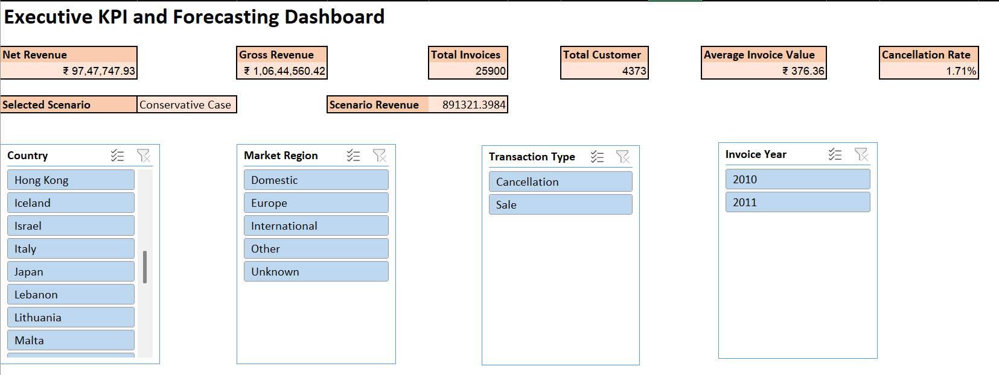
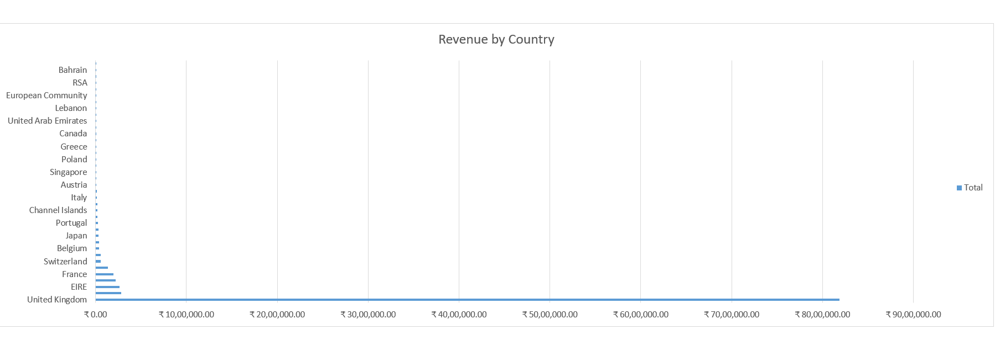
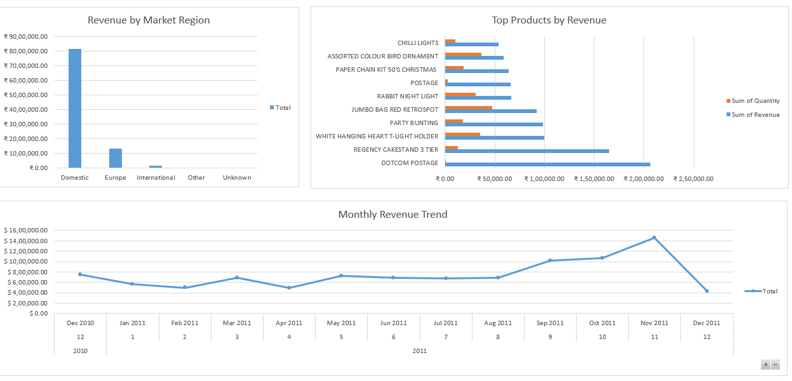

# 📊 Executive KPI and Forecasting Workbook

## 📌 Overview

This project uses **Microsoft Excel** to build an executive KPI and forecasting workbook using real online retail transaction data.

The workbook focuses on revenue performance, customer activity, product demand, market performance, forecasting, and scenario-based decision-making.

---

## 🎯 Objective

To create an Excel-only executive workbook that helps business leaders monitor performance and plan future revenue.

The project answers questions such as:

- What are gross revenue and net revenue?
- Which countries and market regions generate the most revenue?
- Which products generate the highest revenue?
- How does monthly revenue change over time?
- What could revenue look like under different business scenarios?

---

## 📂 Dataset

**Dataset:** UCI Online Retail Dataset  
**Source:** [UCI Machine Learning Repository - Online Retail](https://archive.ics.uci.edu/dataset/352/online+retail)

---

## 🛠️ Tools Used

- Microsoft Excel

---

## 📈 Dashboard Preview

### Dashboard View 1

### Dashboard View 2

### Dashboard View 3

---

## 📊 Key KPIs

| Metric | Description |
|---|---|
| Gross Revenue | Revenue from sale transactions |
| Net Revenue | Revenue after cancellations and returns |
| Total Invoices | Number of invoices in the dataset |
| Total Customers | Number of customers in the dataset |
| Total Products | Number of products in the dataset |
| Average Invoice Value | Net revenue divided by invoices |
| Cancellation Rate | Share of cancellation rows in the dataset |
| Average Unit Price | Average product unit price |

---

## 📌 Dashboard Features

- Executive KPI cards
- Revenue by country
- Revenue by market region
- Top products by revenue
- Monthly revenue trend
- Forecasted revenue view
- Scenario revenue card
- Interactive slicers for:
  - Market Region
  - Country
  - Transaction Type
  - Invoice Year

---

## 🔍 Key Insights

- The United Kingdom contributed the majority of revenue, making it the core domestic market.
- European and international markets provided additional revenue opportunities but were smaller than the domestic market.
- Some transactions included cancellations or negative quantities, showing the importance of separating gross revenue from net revenue.
- Monthly revenue varied across the period, making forecasting useful for executive planning.
- A small group of products contributed a large share of revenue, highlighting the importance of top-product monitoring.

---

## 💡 Recommendations

- Track net revenue separately from gross revenue to account for cancellations and returns.
- Monitor top-performing products regularly to support inventory and promotion decisions.
- Use market region analysis to evaluate domestic, European, and international performance separately.
- Review cancellation activity to identify possible operational or customer issues.
- Use scenario analysis to prepare for optimistic, conservative, and stress-case revenue outcomes.

---

## 🧠 Skills Demonstrated

- Executive KPI design
- Excel data cleaning
- Helper column creation
- `XLOOKUP`
- `INDEX/MATCH`
- `IF` and `IFS` logic
- Data validation dropdowns
- Conditional formatting
- PivotTables
- PivotCharts
- Slicers
- Forecasting with `FORECAST.LINEAR`
- Scenario analysis
- Business insight writing

---
